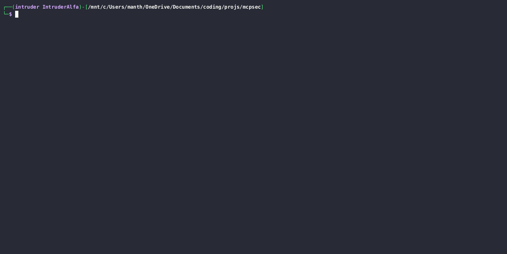

<div align="center">

# mcpsec

**Security scanner and protocol fuzzer for MCP servers**

[](https://opensource.org/licenses/MIT)
[](https://www.python.org/downloads/)
[](https://pypi.org/project/mcpsec/)
[](https://github.com/manthanghasadiya/mcpsec/actions/workflows/ci.yml)
[](https://github.com/manthanghasadiya/mcpsec)
[](https://github.com/manthanghasadiya/mcpsec)
[](https://github.com/manthanghasadiya/mcpsec)
[](https://github.com/manthanghasadiya/mcpsec)
[](https://github.com/manthanghasadiya/mcpsec)

[Installation](#installation) • [Quick Start](#quick-start) • [Audit v3](#static-analysis-audit-v3) • [Scanners](#scanners) • [Fuzzing](#fuzz-generators)

</div>

---

## Why mcpsec?

MCP (Model Context Protocol) connects AI agents to external tools. Claude Desktop, Cursor, VS Code Copilot, and every major AI IDE uses it. **Security is often an afterthought.**

Most MCP security tools do static analysis. **mcpsec connects to live servers and proves exploitation.**



---

## Real Bugs Found

| Target | Vulnerability | Status |
|--------|---------------|--------|
| **MCP Python SDK** | ClosedResourceError DoS (invalid UTF-8) | [Issue #2328](https://github.com/modelcontextprotocol/python-sdk/issues/2328) - Fix in [PR #2334](https://github.com/modelcontextprotocol/python-sdk/pull/2334) |
| **radare2-mcp** | Multiple SIGSEGV via params type confusion | [Issue #42](https://github.com/radareorg/radare2-mcp/issues/42) |
| **radare2-mcp** | Arbitrary RCE via shell escape (!) in run_command/run_javascript | [Issue #45](https://github.com/radareorg/radare2-mcp/issues/45) - Fixed in [commit 482cde6](https://github.com/radareorg/radare2-mcp/commit/482cde6) |
| **radare2-mcp** | SIGSEGV in initialize via params type confusion | [Issue #52](https://github.com/radareorg/radare2-mcp/issues/52) |
| MCP Python SDK | UnicodeDecodeError DoS | [Fixed - PR #2302](https://github.com/modelcontextprotocol/python-sdk/pull/2302) |
| mcp-server-fetch | 61 crash cases, exception handling DoS | [Issue #3359](https://github.com/modelcontextprotocol/servers/issues/3359) |
| mcp-server-git | 61 crash cases | [Issue #3359](https://github.com/modelcontextprotocol/servers/issues/3359) |
| MCP TypeScript SDK | EPIPE crash | [Issue #1564](https://github.com/modelcontextprotocol/typescript-sdk/issues/1564) |
| MCP TypeScript SDK | Integer overflow DoS (MAX_SAFE_INTEGER+1) | [Issue #1765](https://github.com/modelcontextprotocol/typescript-sdk/issues/1765) |

More findings under responsible disclosure.

---

## Installation

```bash
pip install mcpsec
```

For AI-powered features:
```bash
pip install mcpsec[ai]
```

### Nix

```bash
nix-shell   # basic
nix-shell --arg withAll true   # all optional deps
```

---

## Quick Start

### Runtime Scanning
```bash
# Scan via stdio
mcpsec scan --stdio "npx @modelcontextprotocol/server-filesystem /tmp"

# Scan via HTTP with auth
mcpsec scan --http http://localhost:8080/mcp -H "Authorization: Bearer TOKEN"

# Auto-discover and scan all local servers
mcpsec scan --auto

# Enumerate attack surface
mcpsec info --stdio "python my_server.py"
```

### Static Analysis (Audit v3)
```bash
# Local source — pattern-based + AI reachability
mcpsec audit --path ./my-mcp-server

# GitHub repository
mcpsec audit --github https://github.com/user/mcp-server

# With LLM-powered taint analysis
mcpsec audit --github https://github.com/user/mcp-server --ai

# Known vulnerable servers
mcpsec audit --github https://github.com/radareorg/radare2-mcp
```

### Protocol Fuzzing
```bash
# Standard fuzzing (~200 cases)
mcpsec fuzz --stdio "python my_server.py"

# High intensity (~800 cases)
mcpsec fuzz --stdio "python my_server.py" --intensity high

# AI-powered payload generation
mcpsec fuzz --stdio "python my_server.py" --ai
```

### Advanced
```bash
# SQL Injection scanner with DB fingerprinting
mcpsec sql --stdio "npx @benborla29/mcp-server-mysql" --fingerprint

# Dangerous tool chain detection
mcpsec chains --stdio "npx @example/complex-server"

# Interactive exploitation REPL
mcpsec exploit --stdio "npx vulnerable-server"

# Rogue server for client-side testing
mcpsec rogue-server --port 9999 --attack all
```

---

## Static Analysis — Audit v3

> **New in v2.7.1** — Complete rewrite of the audit engine with a pattern-based architecture.

### 7-Stage Analysis Pipeline

```
Source Code
    │
    ├─ 1. Fetch        — Clone GitHub repo or load local path
    ├─ 2. Detect       — Identify language, MCP SDK, and framework
    ├─ 3. Sink Scan    — 3,450+ regex patterns across 12 languages
    ├─ 4. Semgrep      — 149 semantic rules (AST-level)
    ├─ 5. AST          — Python/JS taint flow analysis
    ├─ 6. Reachability — LLM taint tracing (heuristic fallback)
    └─ 7. Deduplicate  — Merge, rank, and report findings
```

### Pattern Database — 3,450+ Sink Patterns

| Vulnerability Class | Patterns | Languages |
|--------------------|----------|-----------|
| Command Injection   | 181      | Python, JS/TS, Go, Rust, Java, C, C#, Ruby, PHP |
| SQL / NoSQL Injection | ~100   | All drivers + ORM-specific (Sequelize, SQLAlchemy, Drizzle, Kysely) |
| Path Traversal      | ~60      | fs, aiofiles, Deno, Bun, tarfile, ZipSlip |
| SSRF                | ~80      | requests, httpx, aiohttp, gRPC, OkHttp, WebSocket, got |
| Deserialization     | ~60      | pickle, YAML, torch.load, numpy, joblib, BinaryFormatter |
| Code Execution      | ~50      | eval, vm, exec, DOM XSS, format strings |
| Template Injection  | ~30      | Jinja2, Pug, EJS, Handlebars, Lodash, ERB, Velocity, Thymeleaf |
| Crypto Weaknesses   | ~40      | MD5/SHA-1, RC4, weak keys, JWT `none` alg |
| XXE                 | ~25      | lxml, untangle, DOMDocument, SAXParser |
| Log/Header/LDAP     | ~50      | All major frameworks |
| Prototype Pollution | ~15      | Object.assign, deepmerge, `__proto__` |
| Sanitizers          | 105      | Command, SQL, Path, XSS sanitizers (Python, JS, Go, Rust) |
| MCP-Specific        | ~45      | Tool args → sinks, prompt/resource handlers (20+ SDKs) |

### Framework Detection

Automatically identifies:
- **MCP SDKs**: `@modelcontextprotocol/sdk`, `mcp` (Python), `mcp-go`, `rmcp` (Rust), `mcpx` (C#)
- **Languages**: TypeScript, JavaScript, Python, Go, Rust, Java, C#, PHP, Ruby, C/C++
- **Frameworks**: Express, FastAPI, Django, Gin, Axum, Spring Boot, ASP.NET

### Heuristic Fallback

When no LLM is configured, the reachability analyzer uses **confidence scoring** to report findings without false silence — high-confidence patterns (CRITICAL/HIGH + direct taint) are always reported.

---

## Scanners

| Scanner | Description |
|---------|-------------|
| `prompt-injection` | Hidden instructions in tool descriptions |
| `command-injection` | OS command injection with 138 payloads |
| `path-traversal` | Directory traversal with 104 payloads |
| `ssrf` | Server-Side Request Forgery with 81 payloads |
| `sql` | SQL Injection (Error, Time, Boolean, Stacked) |
| `auth-audit` | Missing authentication, dangerous tool combos |
| `description-prompt-injection` | LLM manipulation via descriptions |
| `resource-ssrf` | SSRF via MCP resource URIs |
| `capability-escalation` | Undeclared capability abuse |
| `chains` | Dangerous tool combination detection |
| `code-execution` | Detects `eval()`, `exec()`, and `compile()` sinks |
| `template-injection` | Targets SSTI and string formatting vulnerabilities |
| `rag-poisoning` | Identifies dangerous Write→Read data flows |
| `idor` | Insecure Direct Object Reference detection |
| `info-leak` | Environment variable and credential disclosure |
| `deserialization` | Pickle, XXE, and unsafe YAML parsing |

---

## Fuzz Generators

22 generators organized by intensity level:

**Low (~65 cases):** `malformed_json`, `protocol_violation`, `type_confusion`, `boundary_testing`, `unicode_attacks`

**Medium (~200 cases):** + `session_attacks`, `encoding_attacks`, `integer_boundaries`

**High (~800 cases):** + `injection_payloads`, `method_mutations`, `param_mutations`, `timing_attacks`, `header_mutations`, `json_edge_cases`, `protocol_state`, `protocol_state_machine`, `id_confusion`, `concurrency_attacks`, `regex_dos`, `deserialization`

**Insane (~1500+ cases):** + `resource_exhaustion`, `memory_exhaustion_v2`

---

## How It Works

```
┌─────────┐     MCP Protocol      ┌────────────┐
│ mcpsec  │ ◄──── JSON-RPC ────►  │   Target   │
│         │    (stdio / HTTP)     │   Server   │
└────┬────┘                       └────────────┘
     │
     ├── Connect & enumerate attack surface
     ├── Run 10+ security scanners
     ├── Generate 800+ fuzz cases
     ├── Execute AI-powered payload mutations
     ├── Static audit: 3,450+ sink patterns + 149 Semgrep rules
     └── Report findings with PoC evidence
```

---

## Configuration

### AI Provider Setup
```bash
mcpsec setup
```
Supports: OpenAI, Anthropic, Google, Groq, DeepSeek, Ollama

### Output Formats
```bash
# JSON
mcpsec scan --stdio "server" --output results.json

# SARIF 2.1.0 (GitHub/GitLab/Azure DevOps CI/CD)
mcpsec fuzz --stdio "server" --output results.sarif
```

---

## Changelog

### v2.7.1 (2026-04-15) — `staging/audit-v3`
- **Audit v3 — Pattern Database Foundation**: Complete rewrite of the static analysis engine
- **3,450+ Sink Patterns**: Pattern database across 12 vulnerability classes and 12 languages
- **Framework Detector**: Auto-identifies MCP SDK, language, and web framework from source
- **Sink Scanner**: Regex-based scanner with context capture, comment filtering, and negative patterns
- **LLM Reachability Analyzer**: AI-powered taint analysis with heuristic fallback scoring
- **7-Stage Audit Pipeline**: Fetch → Detect → Sink Scan → Semgrep → AST → Reachability → Deduplicate
- **MCP-Specific Patterns**: Tool argument flows, `server.tool`/`server.prompt`/`server.resource` handlers
- **ML/AI Sinks**: `torch.load`, `numpy.load(allow_pickle=True)`, joblib, HuggingFace downloads
- **JWT Patterns**: `none` algorithm, empty secret, disabled verification

### v2.6.1 (2026-03-20)
- CI/CD pipeline with GitHub Actions for automated testing and PyPI releases
- PR and Issue templates for better community contributions
- Nix package support via `shell.nix` for reproducible builds (@AbhiTheModder)
- Environment variables now properly inherited in `mcp_client.py` (@AbhiTheModder)

### v2.6.0 (2026-03-13)
- **Auto-Discovery Scanner**: New `--auto` flag to automatically find and scan MCP servers from Claude, Cursor, VS Code, Windsurf, etc.
- **Windows Unicode Fixes**: Comprehensive fix for `UnicodeEncodeError` on Windows consoles.
- **Pydantic Compatibility**: Resolved `AttributeError` for custom metadata in scan results.

### v2.5.0 (2026-03-04)
- **New Scanners**: `code-execution`, `template-injection`, `rag-poisoning`, `idor`, `info-leak`, `deserialization`
- **Confirmation Proofs**: Added `mcpsec_cmd_success` execution anchor for command injection
- **SSRF Expansion**: Support for `file://` protocol and generic fetch success indicators
- **Robust Parameter Handling**: Automatic dummy argument generation for complex tool schemas
- **Enhanced Classification**: Massive reduction in false positives for blocked/sandboxed tools

### v2.4.0 (2026-02-28)
- **SAST Rules Expansion**: 87 new Semgrep rules → **149 total** across 24 rule files
- Broad patterns for command injection, path traversal, SQL injection, SSRF, deserialization
- Secrets detection: AWS keys, AI API keys, GitHub/Slack tokens, JWT secrets
- MCP-specific rules: dangerous tool names, empty schemas, error leaks, input reflection
- Code smells: security TODOs, empty catches, TLS disabled, CORS *, ReDoS patterns

### v2.3.0 (2026-02-28)
- **Scanner Nuclear Expansion**: Command injection (138), path traversal (104), SSRF (81) payloads
- Encoding bypasses, protocol smuggling, shell-specific evasion
- 5 new fuzz generators: integer boundaries, concurrency, memory exhaustion, regex DoS, deserialization
- SDK-specific Semgrep rules for Go, Rust, Python async, .NET

### v2.2.0 (2026-02-28)
- **SARIF 2.1.0 Output** for CI/CD integration
- CWE mapping and severity scoring
- Audit report export with `--output` and `--format` flags

### v2.1.0 (2026-02-27)
- **AI Exploitation Assistant**: `select`, `run`, `next`, `verdict`, `auto` REPL commands
- Expert controls: `edit`, `aggressive`, `hint` for complex bypasses
- AI learns from manual `call` commands and response history

### v2.0.3 (2026-02-26)
- **MCP Repeater**: Interactive REPL for manual/semi-auto finding validation
- AI payload engine with context-aware recommendations
- Exploit playbooks for SQLi, RCE, SSRF, path traversal
- Automated evidence capture and PoC generation


<details>
<summary>Earlier versions</summary>

### v2.0.2 (2026-02-26)
- Tool chain analysis for dangerous combinations
- Cross-platform Windows support improvements

### v2.0.1 (2026-02-25)
- Advanced SQL scanner with modular detection
- DB fingerprinting for MySQL, Postgres, MSSQL, SQLite

### v2.0.0 (2026-02-24)
- Fuzzing engine v2 with chained state-machine exploration
- AI-powered validation of security findings

</details>

---

## Contributing

See [CONTRIBUTING.md](CONTRIBUTING.md) for guidelines.

CI runs automatically on all PRs — linting with Ruff and cross-platform tests (Ubuntu, Windows, macOS).

---

## Disclaimer

For authorized security testing only. Only scan servers you own or have explicit permission to test.

---

## License

[MIT](LICENSE)

---

<div align="center">

Built by [Manthan Ghasadiya](https://www.linkedin.com/in/man-ghasadiya)

</div>
